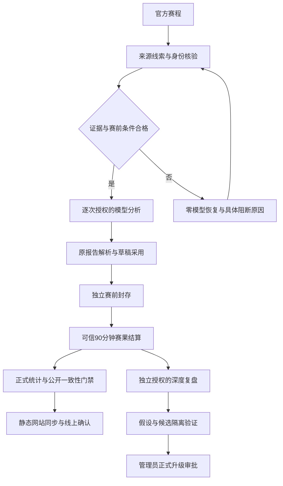

# 架构与边界

```mermaid
flowchart TD
 A[官方赛程] --> B[来源线索与身份核验]
 B --> C{证据与赛前条件合格}
 C -->|是| D[逐次授权的模型分析]
 C -->|否| E[零模型恢复与具体阻断原因]
 E --> B
 D --> F[原报告解析与草稿采用]
 F --> G[独立赛前封存]
 G --> H[可信90分钟赛果结算]
 H --> I[正式统计与公开一致性门禁]
 I --> J[静态网站同步与线上确认]
 H --> K[独立授权的深度复盘]
 K --> L[假设与候选隔离验证]
 L --> M[管理员正式升级审批]
```

来源发现最多2个已审核球队页和3个候选单场，发现阶段最多45秒。网址和球队页不构成赛事身份；发现后的独立校验及采用门禁始终保留。
